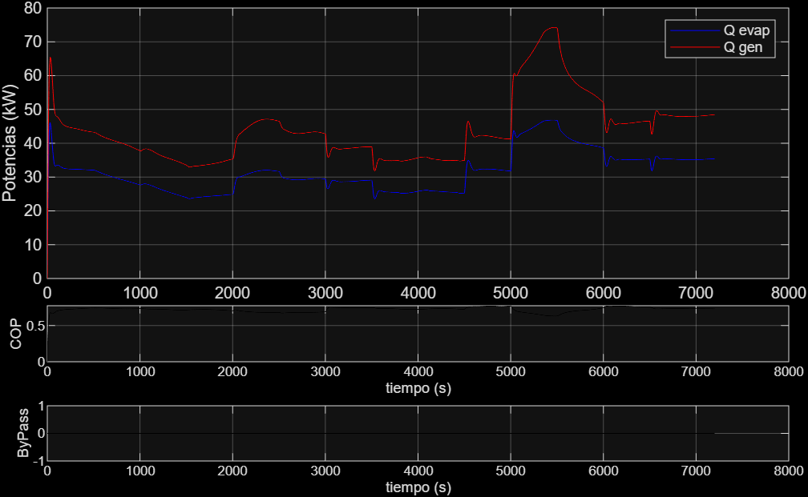

# Análisis de Resultados: Semana 2

Esta semana se estableció la línea base (Baseline) del sistema para comparar futuras mejoras en el control.

## Desempeño del Sistema Base
* **IAE:** 637.8603
* **TV:** 5.5253
* **R1**  1.0064
* **R2**  0.9931
* **J**   1.0037
* **Estado de Bypass:** No activado (0).

## Análisis de Gráficas
A continuación se presentan los resultados obtenidos del simulador:

### Comportamiento Térmico

### Control y Referencia
El error de seguimiento es notable, lo que justifica la necesidad de un nuevo controlador.

### Potencias y Eficiencia

---
## Problemas en el Camino
* **WSL vs Git:** Se experimentaron retrasos de hasta 300s en Git por la carpeta `venv`. Se solucionó implementando un `.gitignore` correcto.
* **Renderizado de Fórmulas:** Se corrigió el archivo `mkdocs.yml` para soportar MathJax, permitiendo visualizar correctamente $T_{eva}$ y $T_{gen}$.