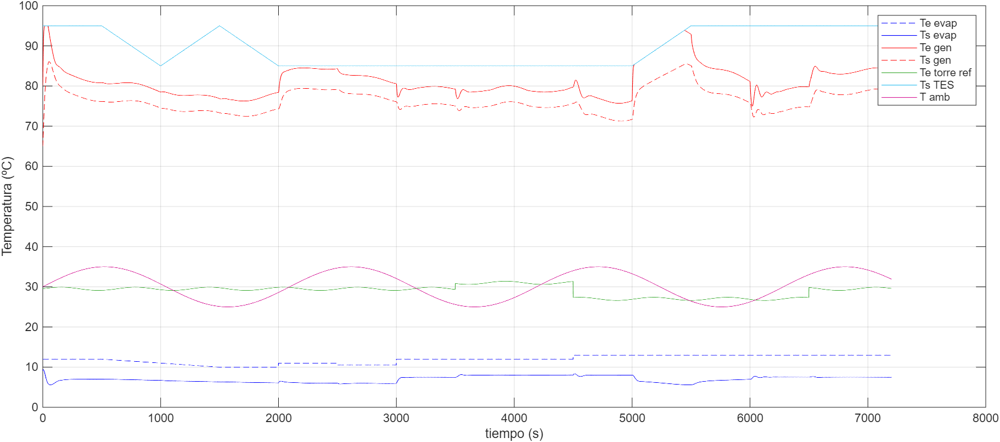
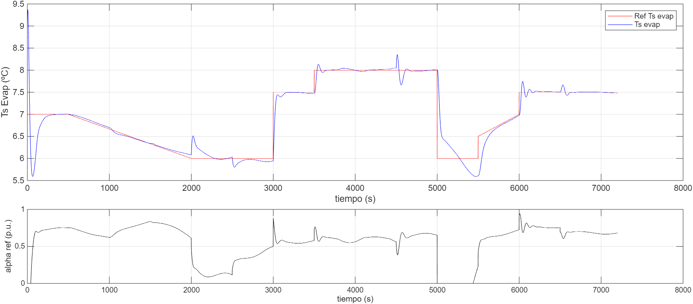
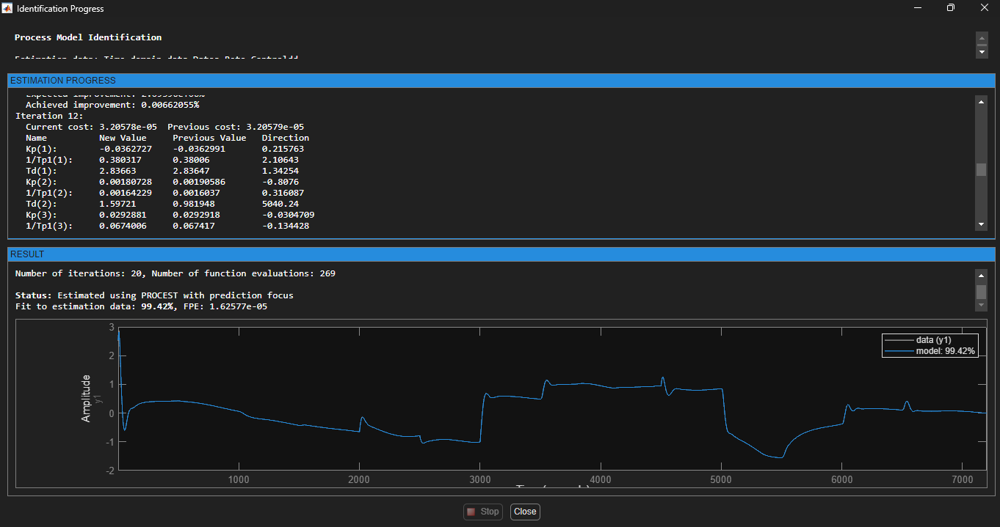

# Análisis de Resultados: Semana 2

Esta semana se estableció la línea base (Baseline) del sistema para comparar futuras mejoras en el control y se realizó la identificación paramétrica del modelo de la planta mediante un enfoque multivariable.

## Desempeño del Sistema Base
* **IAE:** 637.8603
* **TV:** 5.5253
* **R1:** 1.0064
* **R2:** 0.9931
* **J:** 1.0037
* **Estado de Bypass:** No activado (0).

## Análisis de Gráficas
A continuación se presentan los resultados obtenidos del simulador:

### Comportamiento Térmico

### Control y Referencia
El error de seguimiento es notable, lo que justifica la necesidad de un nuevo controlador.

---

## Justificación de Variables (Análisis de Sensibilidad)
Para el diseño del controlador, se realizó un análisis de correlación cruzada con el fin de identificar las variables con mayor impacto sobre la temperatura de salida del evaporador ($T_{s,Evap}$).

### Gráfica de correlación de perturbaciones

**Hallazgos Clave:**
* **$T_{e,Evap}$ ($R = +0.53$):** Es la variable con mayor impacto directo sobre la salida.
* **$T_{s,Gen}$ ($R = -0.47$):** Presenta una fuerte relación inversa, indicando que la energía del generador es crítica.
* **$\alpha_{ref}$ ($R = +0.39$):** Confirma la autoridad del actuador sobre la variable de proceso.
* **$T_{amb}$ ($R = +0.08$):** Se mantiene en el análisis por su relevancia termodinámica a largo plazo.

---

## Identificación de la Planta: Estrategia MISO
Para capturar la complejidad de la máquina Yazaki, se optó por una estrategia de identificación **MISO (Multiple-Input, Single-Output)**. A diferencia de un modelo SISO simple, este enfoque permite desacoplar el efecto de la válvula de mezcla de los efectos de las perturbaciones externas.

### Modelo de mejor ajuste

### Resultados del Modelo P1D (3 Entradas, 1 Salida)
Utilizando el algoritmo `PROCEST` con una precisión de ajuste del **99.42%**, se determinó que la salida $y$ ($T_{s,Evap}$) responde a la suma de tres funciones de transferencia independientes:

$$T_{s,Evap}(s) = G_{11}(s) \cdot \alpha_{ref} + G_{12}(s) \cdot T_{s,Gen} + G_{13}(s) \cdot T_{amb}$$

**Parámetros identificados por canal:**

1. **Canal de Control ($G_{11}$):** * $K_p = -0.0361$, $T_{p1} = 2.62s$, $T_d = 2.84s$.
   * **Interpretación:** Respuesta rápida con ganancia negativa. El retardo ($T_d$) es comparable a la constante de tiempo ($T_{p1}$), lo que exige sintonía robusta.

2. **Canal del Generador ($G_{12}$):** * $K_p = 0.0011$, $T_{p1} = 502.7s$, $T_d = 1.16s$.
   * **Interpretación:** Perturbación de ganancia despreciable pero de dinámica extremadamente lenta.

3. **Canal Ambiente ($G_{13}$):** * $K_p = 0.0292$, $T_{p1} = 14.86s$, $T_d = 26.08s$.
   * **Interpretación:** Impacto significativo con un retardo de transporte de 26 segundos, ideal para implementar **Feedforward**.

---

## Problemas en el Camino
* **WSL vs Git:** Se experimentaron retrasos de hasta 300s en Git por la carpeta `venv`. Se solucionó implementando un `.gitignore` correcto.
* **Renderizado de Fórmulas:** Se corrigió el archivo `mkdocs.yml` para soportar MathJax, permitiendo visualizar correctamente la notación matemática en la bitácora.

"notas"
copia del archivo
- dejar solo la planta 
hacer un modelo de prueba y un modelo de  entrenamiento 
salidas constantes y despues con ruido 
aplicar un cambio escalón primero, despues varias la entrada alpha_ref
hacer una función de de transferencia de las perturbaciones con respecto a la salida que importa en el sistema.