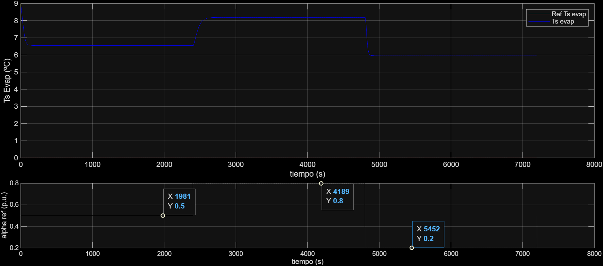
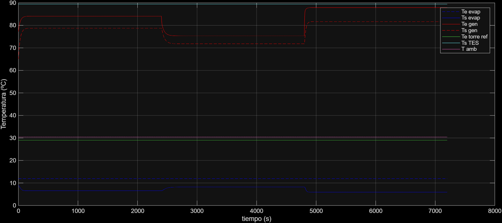
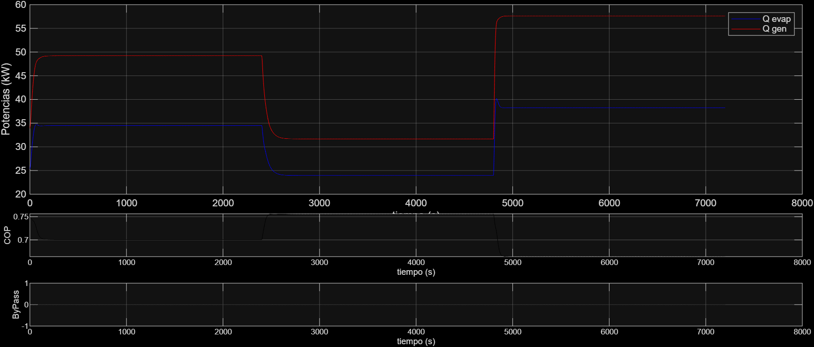
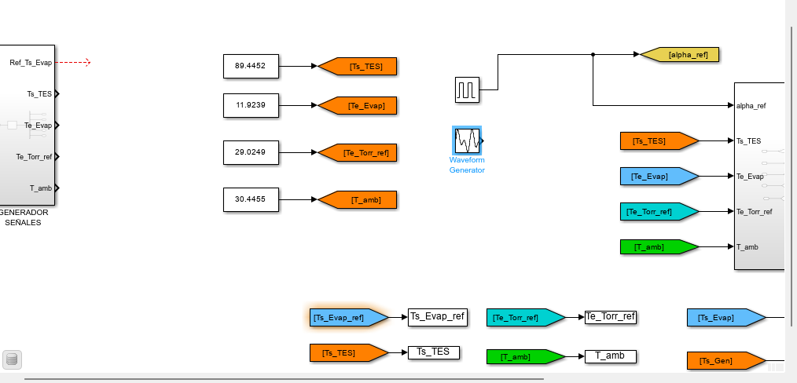
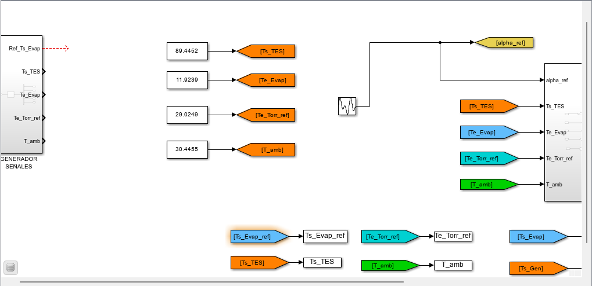
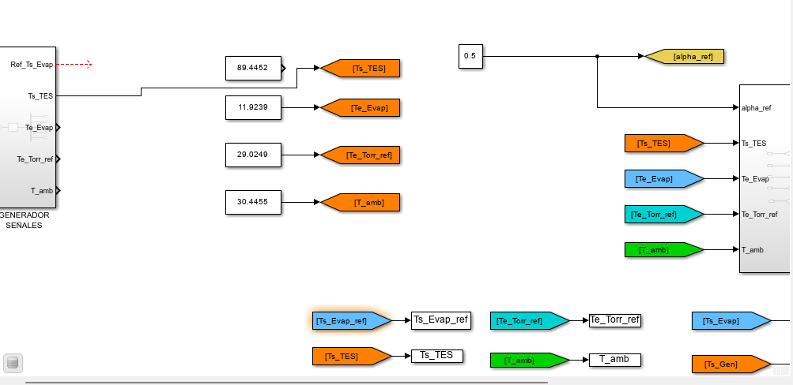
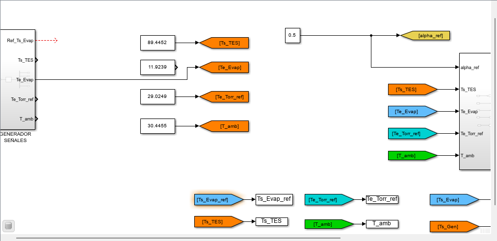
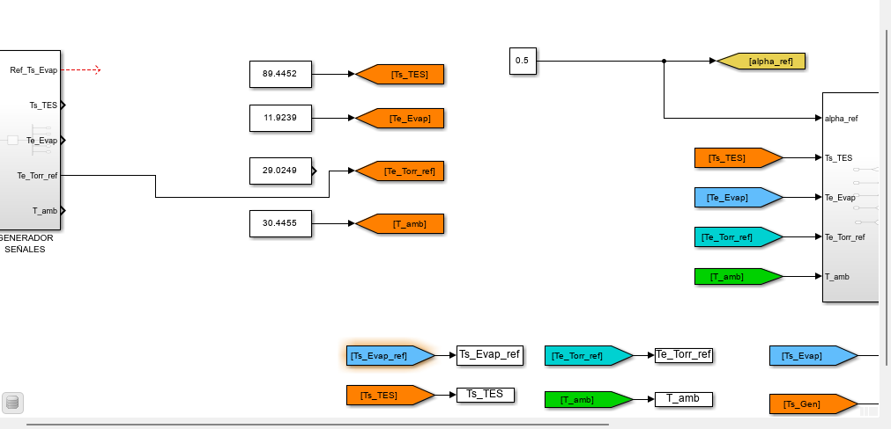

#  Análisis de Resultados: Semana 3

Gracias al programa `valores_promedio.m`, logramos obtener estos valores promedio de las siguientes variables para el punto de operación:

###  Valores Promedio
| Variable | Descripción | Valor Promedio |
| :--- | :--- | :--- |
| **Ts_TES** | Temperatura salida TES | 89.4452 °C |
| **Te_Evap** | Temperatura entrada Evaporador | 11.9239 °C |
| **Te_Torr_ref** | Temperatura entrada Torre Ref. | 29.0249 °C |
| **T_amb** | Temperatura Ambiente | 30.4455 °C |

---

##  Gráficas de Comportamiento Dinámico
Se hicieron steps de $\alpha_{ref}$ que varían de 0.5 a 0.8 y 0.2, obteniendo los siguientes resultados:

*Figura 1: Control alpha_ref vs ts_evap*

*Figura 2: Evolución de Temperaturas*

*Figura 3: Desempeño de Bypass, COP y Potencias*

---

##  Identificación de la Planta: Estrategia SystemIdentification

Para los modelos de planta, se utilizó la estructura de transferencia:
$$G(s) = \frac{K_p}{1+T_{p1}s} e^{-T_d s}$$

### 1. Modelo a señal alpha_ref escalón

Para el modelo con entrada escalón en $\alpha_{ref}$ (0.5 a 0.8 y 0.2), manteniendo temperaturas constantes:

| Parámetro | Valor Estimado | Incertidumbre |
| :--- | :--- | :--- |
| **Kp** | 4.2729 | +/- 0.0303 |
| **Tp1** | 41.932 | +/- 0.3656 |
| **Td** | 7.503 | +/- 0.0009 |

* **Fit to estimation data:** 99.9%
* **Disturbance Model (ARMA):** $C(s) = s + 2$, $D(s) = s + 0.0001$

---

### 2. Modelo alpha_ref senoidal

Aplicando $\alpha_{ref}$ como una senoidal $\sin(0.3, 0.01, 0) + 0.5$:

| Parámetro | Valor Estimado |
| :--- | :--- |
| **Kp** | 13.564 |
| **Tp1** | 692.15 |
| **Td** | 0 |

* **Fit to estimation data:** 99.49%

---

### 3. Modelo de la planta de Ts_TES vs salida Ts_Evap

| Parámetro | Valor Estimado | Incertidumbre |
| :--- | :--- | :--- |
| **Kp** | -0.025154 | +/- 0.00046 |
| **Tp1** | 31.428 | +/- 0.8226 |
| **Td** | 29.479 | +/- 0.0056 |
* **Fit to estimation data:** 99.59%
---

### 4. Modelo de la planta de Te_Evap vs salida Ts_Evap

| Parámetro | Valor Estimado |
| :--- | :--- |
| **Kp** | 0.55115 |
| **Tp1** | 16.718 |
| **Td** | 0 |
* **Fit to estimation data:** 99.85%

---

### 5. Modelo de la planta de Te_Torr_ref vs salida Ts_Evap

| Parámetro | Valor Estimado | Incertidumbre |
| :--- | :--- | :--- |
| **Kp** | 0.10831 | +/- 0.0033 |
| **Tp1** | 60.901 | +/- 1.0472 |
| **Td** | 1.502 | +/- 0.0148 |
* **Fit to estimation data:** 99.7%
---

### 6. Modelo de la planta de T_amb vs salida Ts_Evap

| Parámetro | Valor Estimado | Incertidumbre |
| :--- | :--- | :--- |
| **Kp** | -0.032773 | +/- 0.00077 |
| **Tp1** | 8.7807 | +/- 0.2984 |
| **Td** | 29.504 | +/- 0.0033 |

**Nota:** Algo interesante es que no afecta mucho la temperatura ambiente a $Ts_{Evap}$.
* **Fit to estimation data:** 99.1%

---

#  Comparativa de Modelos: Teórico vs. Identificación Experimental

Esta tabla contrasta los parámetros del modelo de transferencia  

\[
G(s) = \frac{K_p}{1+T_{p1}s} e^{-T_d s}
\]

  
obtenidos mediante el cálculo analítico y las dos estrategias de identificación con superposición.

| Parámetro | 📐 Estimación Teórica | 🔹 Identificación: Escalón | 🔸 Identificación: Oscilación |
| :--- | :---: | :---: | :---: |
| **Ganancia ($K_p$)** | -0.0361 | **4.2729** | **13.564** |
| **Constante de Tiempo ($T_{p1}$)** | 2.62 s | **41.932 s** | **692.15 s** |
| **Retardo ($T_d$)** | 2.84 s | **7.503 s** | **0 s** |

---

