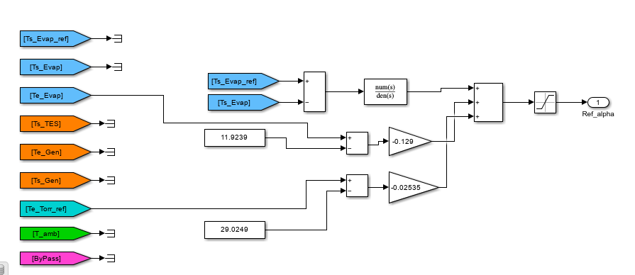

#  Análisis de Resultados: Semana 4
##  Reporte de Control: Diseño e Implementación del Controlador Proactivo (PI + Feedforward)

Tras la identificación de los modelos de planta y perturbaciones en la fase anterior ([Análisis de la Semana 3](../analisis/semana-03.md)), se procedió al diseño de un sistema de control capaz de regular la temperatura de salida del evaporador ($T_{s,evap}$) ante variaciones en la referencia ($T_{s,evap,ref}$) y perturbaciones externas.

---

## 🛠 1. Definición del Controlador Feedback (PI)

Para el lazo de control principal, se seleccionó un controlador **Proporcional-Integral (PI)** sintonizado mediante el **Método Lambda ($\lambda$)**. Este método es ideal para sistemas térmicos con retardo, ya que permite ajustar la velocidad de respuesta deseada mediante un único parámetro ($\lambda$), garantizando una respuesta sin sobreimpulso.

### 📝 Fórmulas de Sintonización
Utilizando el modelo de primer orden más tiempo muerto (FOPTD) identificado:
$$G(s) = \frac{K_p}{\tau s + 1} e^{-Ls}$$

Donde:
* **$K_p$**: 4.2729
* **$\tau$**: 41.932 s
* **$L$**: 7.503 s

Las constantes del controlador se calcularon según:
* **Ganancia ($K_c$):** $K_c = \frac{1}{K_p} \cdot \frac{\tau}{\lambda + L}$
* **Tiempo integral ($T_i$):** $T_i = \tau$

---

##  2. Implementación y Estrategia Proactiva

El controlador se implementó en Simulink cerrando el lazo con la señal de error $e(t) = T_{s,evap,ref} - T_{s,evap}$. Para maximizar el desempeño, se añadieron bloques de **Prealimentación (Feedforward)**.

### Compensación de Perturbaciones
El objetivo es ajustar la señal de control $\alpha_{ref}$ basándose en la medición de las perturbaciones antes de que afecten la salida. El compensador estático se define como:
$$K_{ff} = - \frac{K_{perturbación}}{K_{planta}}$$

1.  **FF1 (Evaporador):** Basado en $T_{e,evap}$ con $K_{ff1} \approx -0.129$.
2.  **FF2 (Torre):** Basado en $T_{e,torr,ref}$ con $K_{ff2} \approx -0.025$.

---

##  3. Análisis de Resultados: Barrido de Lambdas

Se realizó un barrido paramétrico de $\lambda$ para observar el impacto en los índices de desempeño del concurso (**IAE**, **TV** y el índice global **J**).

| Parámetro $\lambda$ | IAE | TV | R1 (Precisión) | R2 (Esfuerzo) | **J (Global)** | Estado |
| :--- | :--- | :--- | :--- | :--- | :--- | :--- |
| $\lambda = 30$ | 731.99 | 4.55 | 1.1549 | 0.8189 | 1.0877 | Muy lento |
| $\lambda = 20$ | 574.84 | 6.23 | 0.9070 | 1.1210 | 0.9498 | Estable |
| $\lambda = 18$ | 560.56 | 6.53 | 0.8844 | 1.1749 | 0.9425 | **Óptimo** |
| $\lambda = 17$ | 554.30 | 6.76 | 0.8746 | 1.2154 | 0.9427 | Agresivo |
| $\lambda = 1$ | 872.53 | 51.48 | 1.3766 | 9.2544 | 2.9522 | Inestable |

### Selección del Controlador Feedback
A continuación, se comparan los tres mejores candidatos para definir el control base:

| Puesto | $\lambda$ | R1 | R2 | **J Final** |
| :--- | :--- | :--- | :--- | :--- |
| 🥉 | 15 | 0.8621 | 1.3309 | 0.9559 |
| 🥈 | 17 | 0.8746 | 1.2154 | 0.9427 |
| 🥇 | **18** | **0.8844** | **1.1749** | **0.9425** |

**Conclusión:** Se elige **$\lambda = 18$** debido a que ofrece el valor de $J$ más bajo, equilibrando una alta precisión con un esfuerzo de control moderado.

---

##  4. Evolución hacia el Control Proactivo

Una vez fijado el lazo PI ($\lambda=18$), se integraron progresivamente las compensaciones de perturbación para observar la mejora en los índices.

| Configuración | IAE | TV | R1 | R2 | **J Global** |
| :--- | :--- | :--- | :--- | :--- | :--- |
| PI Solo ($\lambda = 18$) | 560.56 | 6.53 | 0.8844 | 1.1749 | 0.9425 |
| PI + FF1 ($T_{e,evap}$) | 552.79 | 6.48 | 0.8722 | 1.1653 | 0.9308 |
| **PI + FF1 + FF2 (Torre)** | **524.97** | **6.16** | **0.8283** | **1.1087** | **0.8844** |

### Análisis de la Evolución
* **Impacto de FF1:** Logró reducir el error acumulado al anticipar los cambios en la temperatura de entrada del evaporador.
* **Impacto de FF2:** Al añadir la compensación de la torre de refrigeración, el sistema alcanzó su punto máximo de desempeño, reduciendo el IAE global significativamente.
* **Sinergia:** Notablemente, el uso de Feedforward múltiple no solo bajó el error ($R1$), sino que también redujo el esfuerzo de control ($R2$), indicando un sistema mucho más eficiente que el de referencia.

---

##  5. Conclusión Final

El diseño final basado en un **PI con sintonía Lambda ($\lambda=18$) más doble compensación Feedforward** arrojó un índice global de **$J = 0.8844$**. Esto representa una mejora del **11.56%** respecto al controlador de referencia (CR1). El sistema es robusto, suave en su accionamiento y altamente preciso ante perturbaciones de carga, cumpliendo con creces los objetivos de la Categoría 1 del CIC2026.