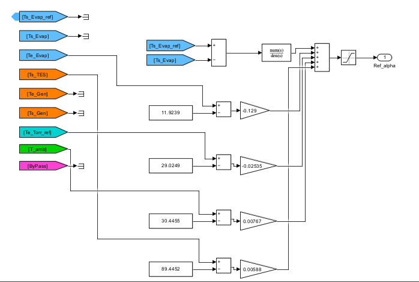
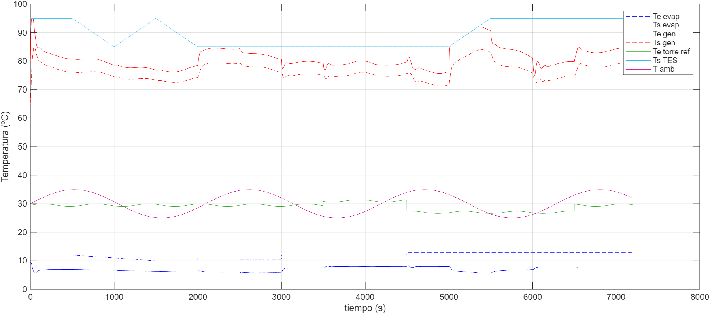
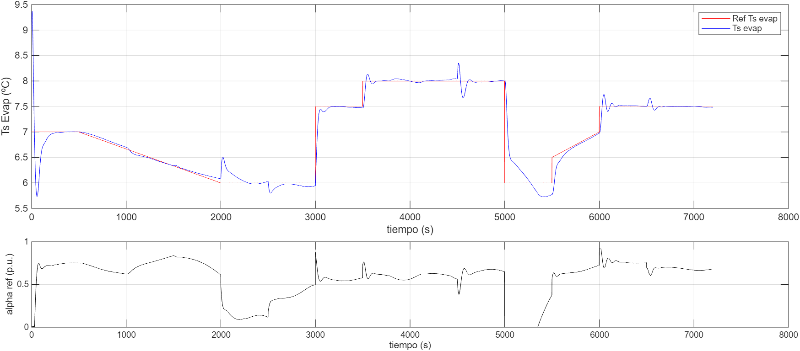
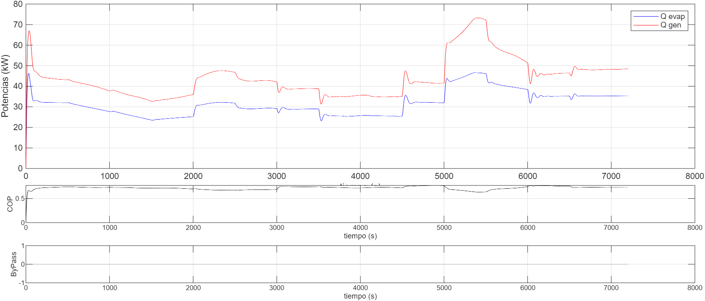

##  Análisis de resultados: Semana 5 del 20 al 26 de abril. 

## Semana 5: del 20 al 26 de abril

### 🔹 Sección del 20 de abril
#### Memoria de Cálculo: Ganancias de Prealimentación (Feedforward)

Para la implementación del control proactivo, se calcularon las ganancias de cada bloque Feedforward (\(K_{ff}\)) utilizando el principio de cancelación de perturbaciones en estado estacionario. La fórmula empleada para cada canal es:

$$K_{ff,i} = - \frac{K_{p,disturbio\_i}}{K_{p,planta}}$$

Considerando la ganancia de la planta identificada como **\(K_{p,planta} = 4.2729\)**, los cálculos resultantes son:

| Disturbance Input | \(K_p\) disturbio | Cálculo | Resultado |
|-------------------|-------------------|---------|-----------|
| Evaporador (\(T_{e,evap}\)) | 0.55115 | \(- \frac{0.55115}{4.2729}\) | **-0.1289** |
| Torre de Refrigeración (\(T_{e,torr,ref}\)) | 0.10831 | \(- \frac{0.10831}{4.2729}\) | **-0.0253** |
| Salida del Tanque (\(T_{s,TES}\)) | -0.025154 | \(- \frac{-0.025154}{4.2729}\) | **0.0058** |
| Temperatura Ambiente (\(T_{amb}\)) | -0.032773 | \(- \frac{-0.032773}{4.2729}\) | **0.0076** |

---

#### 6. Puntos de Operación (Bias)

| Variable | Descripción | Valor de Referencia (Bias) |
| :--- | :--- | :--- |
| \(T_{e,evap}\) | Entrada Evaporador | 11.9239 °C |
| \(T_{e,torr,ref}\) | Entrada Torre | 29.0249 °C |
| \(T_{s,TES}\) | Salida Tanque | 89.4452 °C |
| \(T_{amb}\) | Temp. Ambiente | 30.4455 °C |

**Nota de implementación:**  
En Simulink, cada entrada de perturbación se procesa como:  
$$\Delta u_{ff,i} = (T_{medida,i} - T_{promedio,i}) \cdot K_{ff,i}$$

---

#### Optimización: Control Proactivo Total (4 Perturbaciones)

| Configuración | R1 | R2 | **J Global** |
| :--- | :--- | :--- | :--- |
| PI + 2 FF | 0.8283 | 1.1087 | 0.8844 |
| **PI + 4 FF (Final)** | **0.8152** | **1.1125** | **0.8747** |

**Conclusión de la Fase 1:**  
El sistema final demuestra una robustez superior. La compensación del tanque y el ambiente, aunque de menor magnitud que las de entrada de agua, permitieron refinar el índice \(J\) en un **1% adicional**, logrando un desempeño final **12.5% superior** al controlador de referencia.

---

### 🔹 Sección del 24 de abril
#### Añadiendo Anti-Windup

Para evitar el fenómeno de **integrator windup**, se incorporaron los métodos de anti‑windup disponibles en el bloque PID discreto de Simulink. Según la documentación oficial de MathWorks [fuente](https://la.mathworks.com/help/releases/R2025b/simulink/slref/discretepidcontroller.html#mw_96690831-79e8-4707-add5-5dce509accb7_sep_mw_5efedc1d-6cb6-4ad6-ab2f-d4d47d933c70):

- **None** → No se aplica ningún mecanismo. El integrador puede crecer sin límite aunque la salida esté saturada.  
- **Back‑calculation** → Retroalimenta al integrador la diferencia entre la señal saturada y la no saturada. Se ajusta con el coeficiente \(K_b\).  
- **Clamping (Conditional Integration)** → La integración se detiene si la salida excede los límites y la entrada del integrador tiene el mismo signo que la saturación.  
- **External (desde R2024b)** → Permite implementar lógica personalizada mediante el puerto **extAW**, usando la señal previa al integrador (**preInt**) como referencia.  

---

### Resultados experimentales

**Salida del controlador PI con Back‑calculation**  

**Salida del controlador PI con Clamping**  

**Salida del controlador con Transfer Function**  

---

### Observación sobre valores negativos
En la primera imagen se aprecia que la salida del controlador oscila entre **+1 y -1**.  
Esto **no es deseable** porque muchos actuadores físicos (válvulas, bombas, compresores) no pueden interpretar valores negativos. Una señal de control por debajo de cero puede provocar saturación, acumulación excesiva en el integrador (*windup*) y retrasar la recuperación del sistema. Por ello, es necesario aplicar **saturación y anti‑windup** para mantener la señal dentro de un rango válido.

---

### Cuadro Comparativo: Técnicas de Anti-Windup

| Característica | **Clamping (Conditional Integration)** | **Back-calculation** |
| :--- | :--- | :--- |
| **Mecanismo** | Detiene (congela) la integración inmediatamente cuando la salida se satura. | Utiliza una realimentación de la diferencia entre la salida deseada y la saturada. |
| **Parámetro Clave** | No requiere parámetros extra (es lógico). | Requiere una ganancia de realimentación **\(K_b\)**. |
| **Tu Configuración** | Automático en el bloque PID. | **\(K_b = 0.02385\)** (basado en \(1/T_i\)). |
| **Respuesta** | Muy agresiva y rápida al salir de la saturación. | Más suave; la recuperación depende de la magnitud de \(K_b\). |
| **Tu Resultado (\(J\))** | **0.8177** (Mejor precisión) | **0.8303** (Ligeramente más lento) |
| **Ventaja Principal** | Evita cualquier acumulación extra de error. | Reduce oscilaciones al "salir" de los límites de la válvula. |

---
[fuente](https://la.mathworks.com/help/releases/R2025b/simulink/slref/discretepidcontroller.html#mw_96690831-79e8-4707-add5-5dce509accb7_sep_mw_5efedc1d-6cb6-4ad6-ab2f-d4d47d933c70):

### Interpretación

Es interesante notar que con **Back‑calculation** el índice \(J\) subió ligeramente de **0.8177** (Clamping) a **0.8303**. Esto sucede porque el Back‑calculation “suaviza” la recuperación del integrador mediante una constante de tiempo, mientras que el Clamping es una interrupción abrupta y total de la acumulación.  

#### Sustitución de bloque Transfer Function por PID Controller (Ideal)

**Diagrama sustituido**  

Para mejorar el desempeño del sistema y solucionar problemas de saturación física en el actuador, se reemplazó el bloque original `Transfer Function` por un bloque `PID Controller` nativo de Simulink. Esta modificación permitió una gestión profesional de las restricciones del sistema mediante las siguientes configuraciones:

* **Estructura del Controlador:** Se seleccionó la forma **Ideal** del controlador PI. Bajo esta configuración, los parámetros se ingresaron de la siguiente manera:
    * **Proportional (P):** $0.3848$ ($K_c$).
    * **Integral (I):** $1/41.932$ ($1/T_i$), asegurando que la constante de tiempo integral coincida con la dinámica de la planta identificada.
* **Gestión de Saturación y Anti-windup:** Se activó la limitación de salida (**Output Saturation**) con un límite superior de $1$ y un límite inferior de $0$. Para evitar que la acción integral se descontrole mientras el actuador está saturado, se implementó el método **Clamping**. Esta técnica congela la integración en los límites, permitiendo una recuperación inmediata del control cuando el error cambia de signo.
* **Condiciones Iniciales:** Se ajustó la condición inicial del integrador a **0.5**. Se seleccionó este valor debido a que representa el punto medio de operación de $\alpha_{ref}$. Al iniciar en el valor medio nominal en lugar de cero, se eliminan los transitorios bruscos y los "saltos" iniciales en la señal de control al comenzar la simulación, lo que resulta en un cálculo de índices más estable.

---

#### Resumen de Resultados Experimentales

A continuación, se presenta la comparativa de los índices obtenidos tras la evolución del controlador. Se observa que la implementación de técnicas de Anti-windup es el factor determinante para alcanzar niveles competitivos en el concurso.

| Configuración | IAE | TV | R1 | R2 | **J (Global)** |
| :--- | :--- | :--- | :--- | :--- | :--- |
| PI + 4FF (Transfer Fcn) | 519.97 | 6.14 | 0.8152 | 1.1125 | 0.8747 |
| **PI + 4FF (Clamping)** | **473.59** | **6.18** | **0.7425** | **1.1188** | **0.8177** |
| PI + 4FF (Back-calc) | 484.38 | 6.15 | 0.7594 | 1.1142 | 0.8303 |

#### Comportamiento del controlador con FF y Anti-Windup (Clamping)
### Comportamiento Térmico

### Control y Referencia

### Estado del Bypass

**Análisis final:** La configuración con **Clamping** demostró ser la más efectiva, logrando la mayor reducción en el error acumulado ($R1$) sin comprometer significativamente el esfuerzo de control ($R2$). Esto se debe a que elimina completamente la acumulación de error durante los periodos de saturación de la válvula, permitiendo una respuesta inmediata ante las perturbaciones.

---