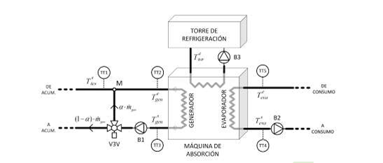
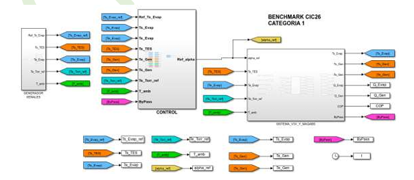

# Escuela de Ingeniería Eléctrica
## Universidad de Costa Rica

**Proyecto Eléctrico (IE-0499)** **Bitácora de Avances: Primer Semestre 2026**

---

# Proyecto Eléctrico CIC2026 – Categoría 1

Este proyecto corresponde a mi participación en el **Concurso de Ingeniería de Control 2026 (CIC2026)**, organizado por el Comité Español de Automática (CEA). 

El objetivo primordial es el diseño de un **controlador monovariable** para una máquina de absorción de frío solar de 35 kW (modelo Yazaki WFC10). El controlador debe ser capaz de regular la **temperatura de salida del evaporador ($T_{eva}$)**, rechazando perturbaciones externas críticas como variaciones en la temperatura del acumulador, del agua de la torre de refrigeración y las condiciones del ambiente.

---

## Diagrama del Sistema

---

## Variables de Operación

A continuación se detallan los parámetros de entrada y salida configurados en el entorno de **Simulink**:

### Entradas (Manipuladas y Perturbaciones)
| Variable | Nombre Simulink | Rango | Unidades | Sensor |
| :--- | :--- | :--- | :--- | :--- |
| Ratio de recirculación ($a_{ref}$) | `alpha_ref` | [0 – 1] | – | – |
| Temp. salida acumulador ($T_{tes}$) | `Ts_TES` | [77 – 100] | ºC | TT1 |
| Temp. entrada evaporador ($T_{eva}$) | `Te_Evap` | [10 – 30] | ºC | TT5 |
| Temp. torre refrigeración ref. ($T_{tor,ref}$) | `Te_Torr_ref` | [25 – 31] | ºC | – |
| Temp. ambiente ($T_{amb}$) | `T_amb` | [20 – 40] | ºC | – |

### Salidas (Monitoreadas)
| Variable | Nombre Simulink | Unidades | Sensor |
| :--- | :--- | :--- | :--- |
| Temp. salida evaporador ($T_{eva}$) | `Ts_Evap` | ºC | TT4 |
| Temp. salida generador ($T_{s\_gen}$) | `Ts_Gen` | ºC | TT3 |
| Temp. entrada generador ($T_{e\_gen}$) | `Te_Gen` | ºC | TT2 |
| Potencia absorbida evaporador ($Q_{Evap}$) | `Q_Evap` | kW | – |
| Potencia absorbida generador ($Q_{Gen}$) | `Q_Gen` | kW | – |
| Coeficiente de rendimiento (COP) | `COP` | – | – |
| Estado de bypass | `Bypass` | 0/1 | – |

---

## Restricciones Críticas de Operación

Para garantizar la integridad física de la máquina y evitar el bloqueo del sistema, se deben respetar los siguientes límites:

* **Generador:** $T_{gen} \in [75, 95]$ ºC
* **Evaporador:** $T_{eva} \ge 5$ ºC
* **Torre de refrigeración:** $T_{tor} \in [25, 32]$ ºC

!!! danger "Advertencia de Seguridad"
    Si alguna de estas condiciones se incumple, la máquina activa un **bypass interno** de forma automática y el sistema deja de producir frío inmediatamente.

---

##  Análisis de Control y Sintonización

Tras completar la fase de identificación de la planta, se procedió a un análisis exhaustivo de tres metodologías de sintonización para encontrar el equilibrio óptimo entre precisión y preservación de los actuadores. A continuación, se presenta la comparativa visual y técnica de los resultados obtenidos.

### 1. Comparativa de Métodos Investigados

Se evaluaron tres enfoques distintos, cada uno con una filosofía de control particular:

* **Método Lambda (PI):** Enfocado en una respuesta suave y robusta. Fue nuestra base de diseño para estabilizar el sistema con los 4 lazos de *Feedforward*.
* **Ziegler-Nichols (PID):** Un método agresivo basado en la respuesta última del sistema. Aunque redujo el error drásticamente, generó un esfuerzo de control excesivo.
* **IMC - Internal Model Control (PID):** El método definitivo, que utiliza el modelo de la planta para cancelar dinámicas lentas, permitiendo un ajuste fino mediante el parámetro de robustez $\lambda$.

#### Visualización de Desempeño
A continuación se presentan las gráficas de respuesta para cada controlador configurado:

**Salida del controlador PI (Método Lambda)** 

**Salida del controlador PID - Ziegler-Nichols** 

**Salida del controlador PID - IMC** 

---

###  El "Controlador mas óptimo": PID - IMC ($\lambda = 9$)

Tras el barrido paramétrico, el controlador **PID sintonizado mediante IMC con $\lambda = 9$** se consolidó como la solución ganadora, logrando un índice récord de **J = 0.7265**. 

Este controlador destaca por reducir el error acumulado ($R1$) en un **27%** respecto al controlador de referencia, manteniendo un esfuerzo de control ($R2$) físicamente viable para la máquina Yazaki.

#### Parámetros Técnicos del Controlador Estrella
| Parámetro | Símbolo | Valor |
| :--- | :--- | :--- |
| **Ganancia Proporcional** | $K_c$ | 0.3848 |
| **Tiempo Integral** | $T_i$ | 41.932 s |
| **Acción Integral (Simulink)** | $1/T_i$ | 0.02385 |
| **Tiempo Derivativo** | $T_d$ | 3.443 s |
| **Filtro Derivativo** | $N$ | 10 (aprox) |
| **Anti-windup** | Método | Clamping |
| **Condición Inicial** | $IC$ | 0.5 |

---

##  Resumen de la Evolución de Índices

| Configuración | R1 (Precisión) | R2 (Esfuerzo) | **Índice J** |
| :--- | :--- | :--- | :--- |
| PI Lambda ($\lambda=18$) | 0.7425 | 1.1188 | 0.8177 |
| PID Ziegler-Nichols | 0.4614 | 3.7052 | 1.1101 |
| **PID IMC ($\lambda=9$)** | **0.5251** | **1.5321** | **0.7265** |

---

###  Mejora Respecto al Controlador de Referencia (CR)

La efectividad de la estrategia **PID-IMC + 4FF** se valida al contrastar los resultados con el controlador de referencia proporcionado por la organización del CIC2026. 

| Métrica | Controlador de Referencia (CR) | **PID - IMC ($\lambda = 9$)** | **Mejora (%)** |
| :--- | :--- | :--- | :--- |
| **Índice J (Global)** | 1.0000 | **0.7265** |  **27.35%** |
| **R1 (Precisión)** | 1.0000 | **0.5251** | g **47.49%** |

**Análisis de Impacto:**
La implementación del esquema proactivo y la sintonía fina por modelo interno permitieron reducir el error acumulado casi a la mitad (**-47.5%**) en comparación con el controlador estándar. Aunque el esfuerzo de control ($R2$) aumentó ligeramente para lograr esta precisión, el balance global ($J$) sitúa a esta solución un **27% por encima** del rendimiento base, cumpliendo con creces los objetivos de optimización del certamen.

---

> **Conclusión técnica:** La implementación del IMC permitió "domar" la agresividad del PID, obteniendo una precisión comparable a Ziegler-Nichols pero con un ahorro del **58% en el esfuerzo del actuador (TV)**, garantizando la longevidad mecánica de la planta.